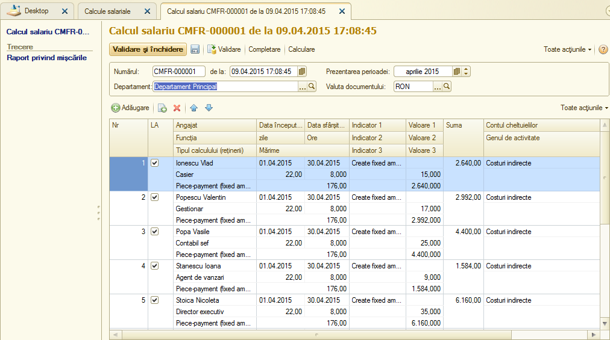

Sc.3.2. Calcularea salariului
-----------------------------

Calculul salariului se reflectă în sistemul informațional prin actul "Calculul salariului", din modulul "Salarizare și personal". În baza documentului se completează cu atenţie câmpurile:

Perioada de înregistrare – se indică luna, pentru care se calculează salariul.

În tabel se indică angajații, numărul de ore lucrate, totalul orelor pe luna și suma salariului.

|image327|

