Scenarii de implementare "1C:BusinessManagementSuite"
=======================================================

Sc.3. Exemplu de implementare a sistemului informațional "1C:BusinessManagementSuite" în cadrul unei companii cu domeniul de activitate "Construcții"
=====================================================================================================================================================

În **"1C:BMS Construcții"** putem organiza evidenţa calculului costului lucrărilor de construcţie cu un ciclu de lucru de lungă durată (mai mult de o lună).

Pentru a realiza acest lucru, mergem în secțiunea "Administrare", "Întreprindere", "Altele" și bifăm *"Utilizare metodă de evidență a casieriei pe bază de venituri si cheltuieli și Utilizare bugetară"*

Înainte de a trece la partea de evidenţă, trebuie să identificăm cheltuielile, care stau la baza obiectivelor noastre. Cheltuielile în programul "1C:BMS Constructii" vor fi înregistrate de utilizatori accesând fila "Întreprindere", "Planificare", în documentul *"Buget"* la secțiunea *"Venituri și cheltuieli"*. Pentru evidenţa cheltuielilor în configuraţia 1C:BMS Construcții sunt disponibile două tipuri de cheltuieli:

Cheltuieli directe - se reflectă cheltuielile directe, adică cheltuielile care pot fi atribuite nemijlocit la o unitate concretă de producţie.

Cheltuieli indirecte - după cum se subînţelege din denumire, sunt reflectate cheltuielile indirecte, adică cheltuielile care nu pot fi atribuite la o unitate concretă de producţie, care la sfârşitul lunii, trebuie să fie repartizate pe produsul executat.

Crearea bugetului de venituri și cheltuieli

    |image308|

Sc.3.1. Crearea catalogului Nomenclator
---------------------------------------

Se vor crea nomenclatoare cu privire la activitatea de construcții, precum: Materii prime, Materiale consumabile, Obiecte de inventar, etc.

|image309|

Popularea nomenclatoarelor cu articole

|image310|

Salvarea articolului Adezivi în nomenclatorul Materii prime

|image311|

Vom crea mai departe serviciile prestate de întreprindere.

|image312|

Când toate cheltuielile sunt înregistrate şi sunt create toate elementele de tip nomenclator necesare, putem trece la înregistrarea documentului "Comanda clientului"

|image313|

Se poate observa din document, comanda am primit-o pe 07.01.2015, pe când predarea produsului finit este programată pe 13.08.2015.

Astfel, comanda clientului este întregistrată , apoi se procedează la comanda către furnizor pentru a ne aproviziona cu materiile prime necesare.

Pentru o evidență mai buna a documentelor este recomandată parcurgerea lanțului de documente în ceea ce privește achizițiile.

În data de 15.01.2015 se înregistrează primirea materialelor de la furnizor în baza documentului "Comandă către frunizor".

|image314|

"Factura proformă primită"

|image315|

"Cumpărări mărfuri și servicii"

|image316|

Repartizarea cheltuielilor de transport asupra cantității

|image317|

"Plată bancară"

|image318|

Aceste materiale vor fi folosite pentru executarea lucrărilor. Operaţia am înregistrat-o cu ajutorul a două documente:

- 15.01.2015 am înregistrat factura primită de la furnizor cu ajutorul documentului "Comanda furnizor";

- În aceeași zi am înregistrat primirea materiilor prime, acest lucru fiind reflectat prin documentul "Cumpărări marfuri și servicii", pe care l-am creat automat în baza documentului "Comanda furnizorului".De asemenea am indicat că materiile prime de care avem nevoie sosesc direct la depozitul principal Armoniei.

Realizarea de cumpărări mărfuri și servicii prin butonul "Creare pe bază".

|image319|

Pentru executarea lucrărilor, de la Depozitul Armoniei am transmis materiale și la depozitul de construcții Biruinței. Această operaţiune am înregistrat-o cu documentul "Transfer de stocuri".

|image320|
==========

La sfârșitul lunii este timpul pentru a primi rapoartele cu privire la desfășurarea lucrărilor. Am înregistrat documentele pentru lucrările executate, ne-a rămas să aflăm ce materiale au fost consumate în această perioadă şi să le înregistrăm în costul lucrărilor noastre.

Putem verifica transferul de materiale între depozite cu ajutorul raportului "Transfer de stocuri".

Raport privind transferul de materiale între depozite.

|image321|

Raport privind achizițiile.

|image322|

Înainte de închiderea lunii, ne-a rămas să facem ultimul pas, şi anume repatizarea cheltuielilor in procesul de construire a blocului. Această operaţie se înregistrează în "1C:BMS Construcții" cu documentul "Repartizarea cheltuielilor", care se află la secțiunea "Producţie".

Pe documentul *"Repartizarea cheltuielilor"* se află trei file:

1. prima filă este *"Producţia"* - unde se află informaţiile despre produsul finit pe care dorim să repartizăm cheltuielile;

"Repartizarea cheltuielilor" pe baza comenzii producției.

|image323|

2. în cea de-a doua filă "Stocuri" se reflectă informaţia despre materialele care compun produsul finit. În cazul nostru, dacă am completat corect pagina "Producţie", putem folosi butonul "Completare", la tastarea caruia partea tabelară "Stocuri" se completează automat cu materialele pe care le-am indicat în procedeul de construcție Apoi tastăm "Repartizare" şi repartizăm cheltuielile pe costul obiectului nostru.

Completarea automată a materialelor din compoziția produsului finit.

|image324|

3. A treia pagină "Cheltuieli" reflectă informaţia despre cheltuielile transcrise în costul producţiei. În cazul nostru, dacă am completat corect pagina "Producţie" putem tasta "Completare" după care partea tabelară a filei "Cheltuieli" se va completa automat cu cheltuielile atribuite şi se vor ataşa la "Comanda cumpărătorului". Apoi tastăm "Repartizarea" şi repartizăm cheltuielile pe costul obiectului nostru.

Repartizarea efectiva a cheltuielilor asupra costului produsului finit.

|image325|

"Comanda de lucru"

Informaţiile despre venituri, cheltuieli și profit le puteţi observa din raportul "Venituri și cheltuieli".

|image326|

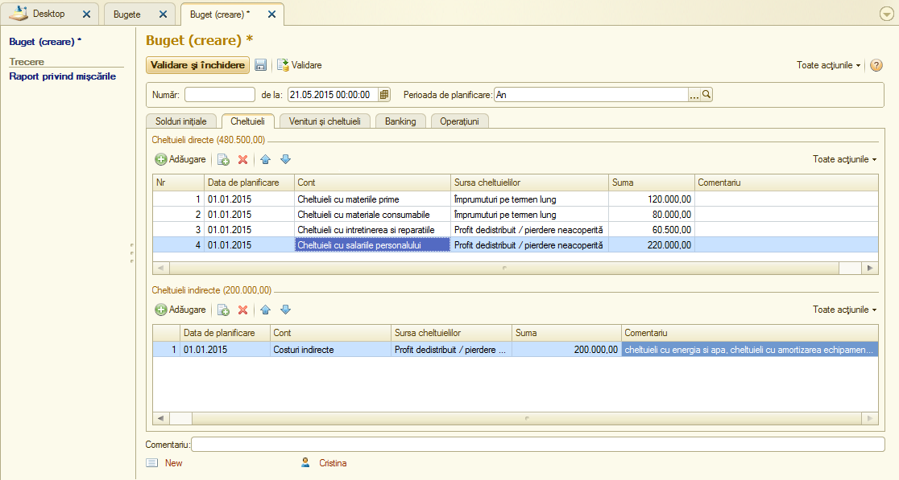
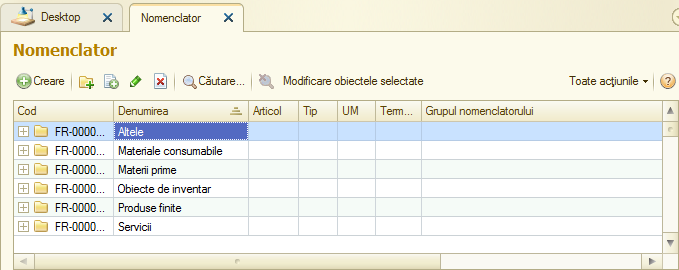
.. |image310| image:: media/image311.png
   :width: 6.08in
   :height: 3.624in
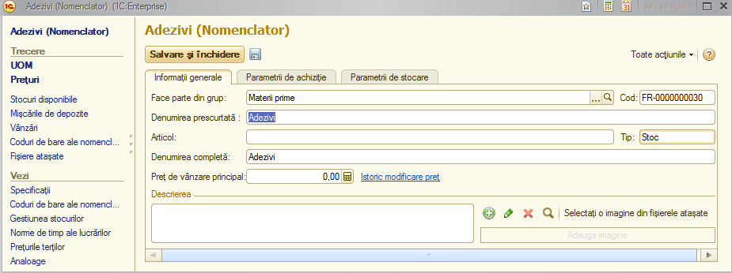
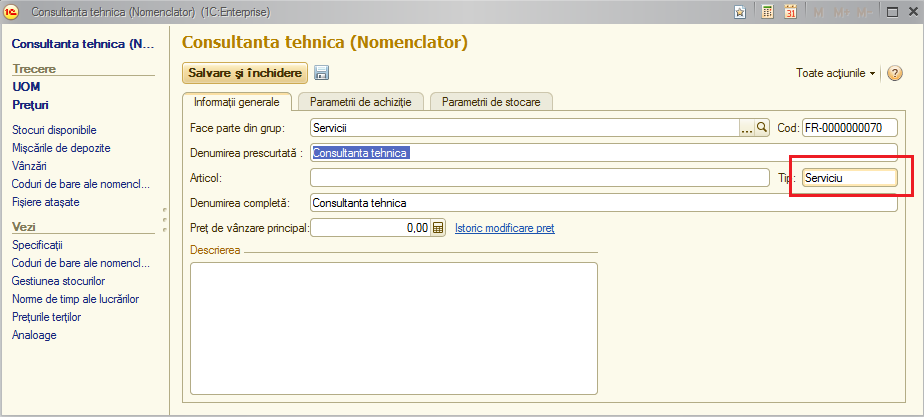
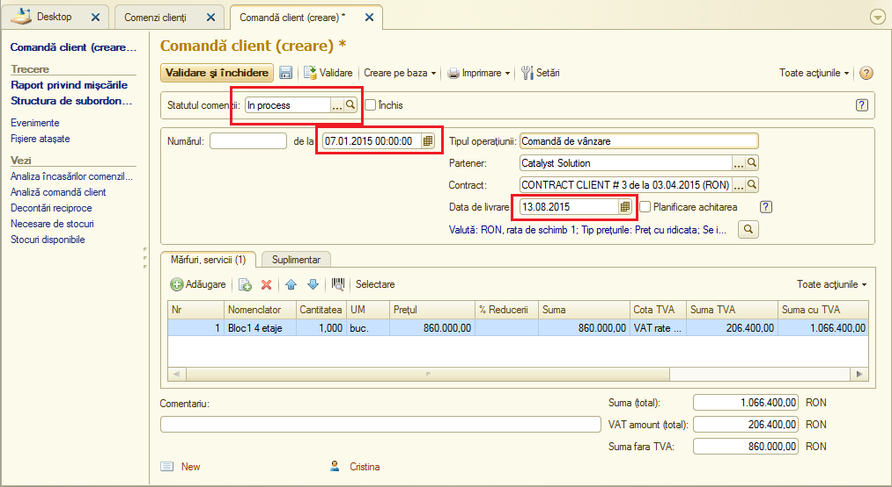
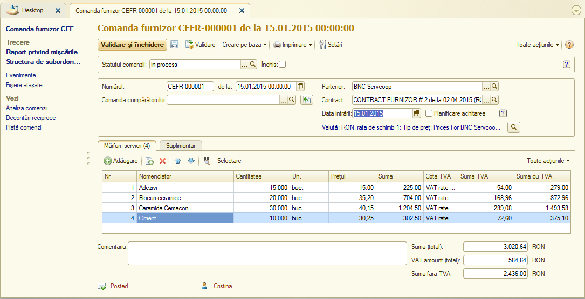
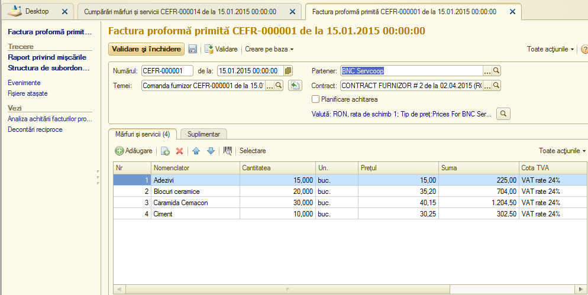
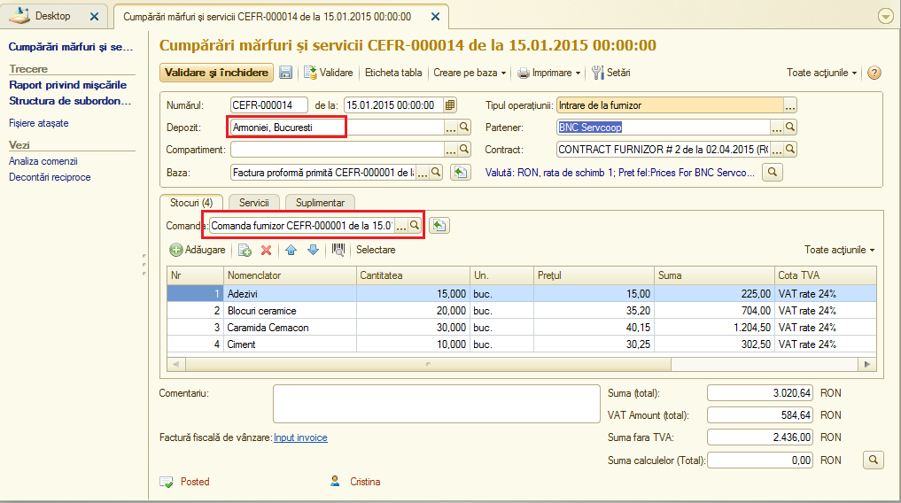
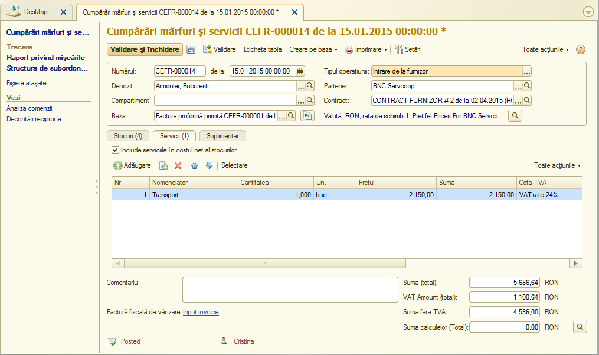
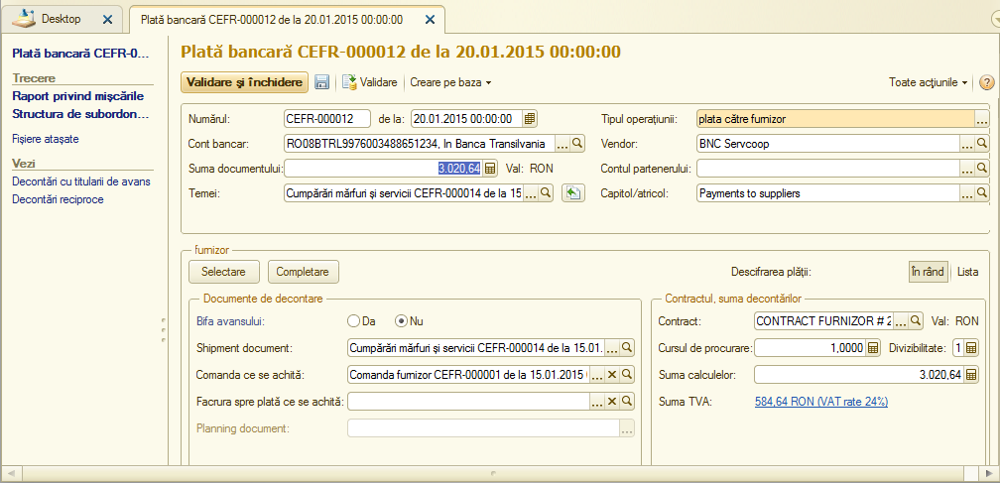
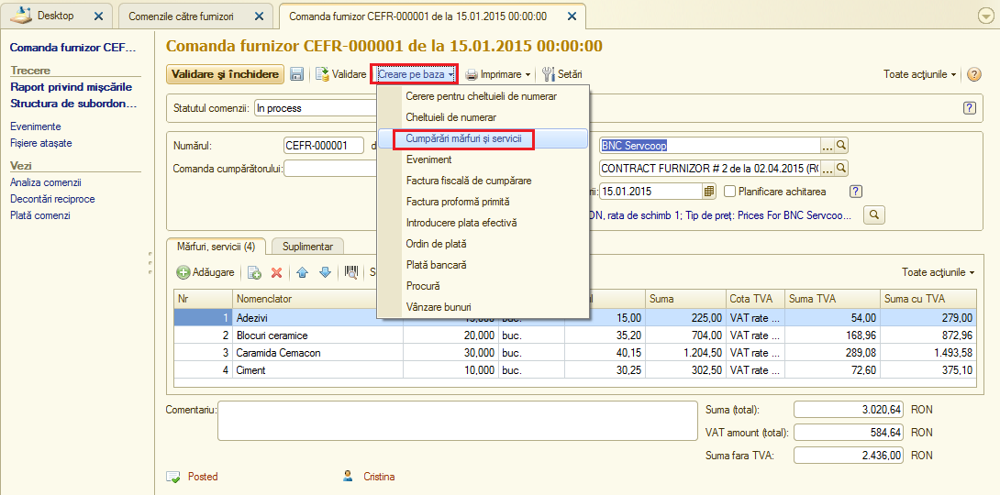
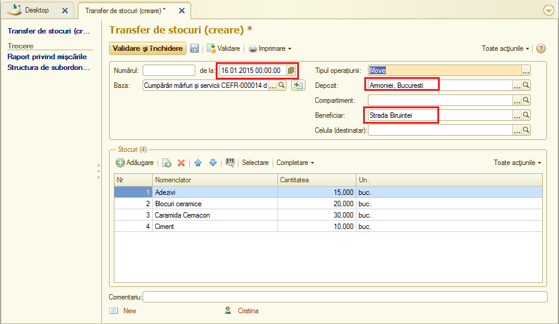
.. |image321| image:: media/image322.png
   :width: 5.62264in
   :height: 3.54182in
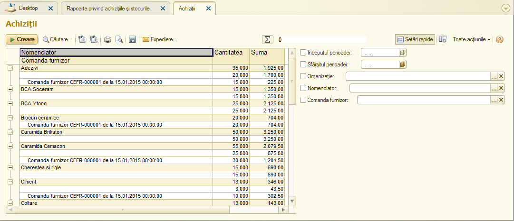
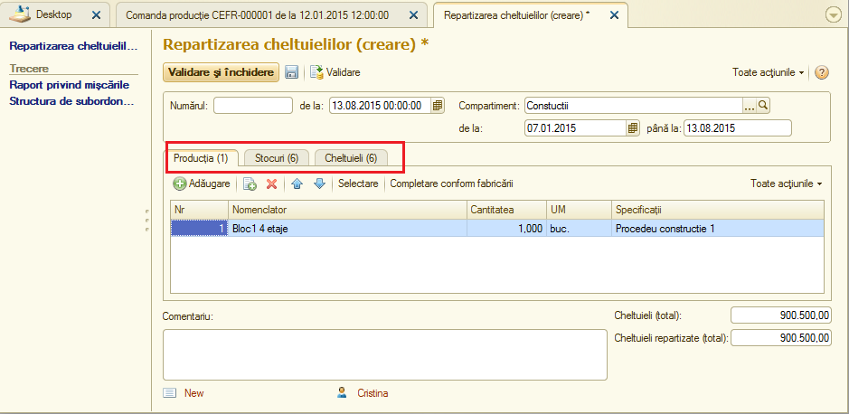
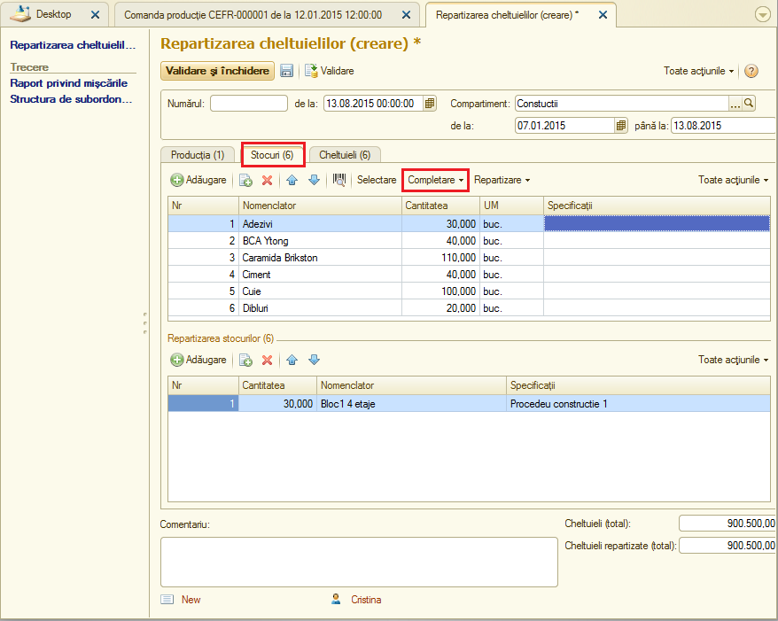
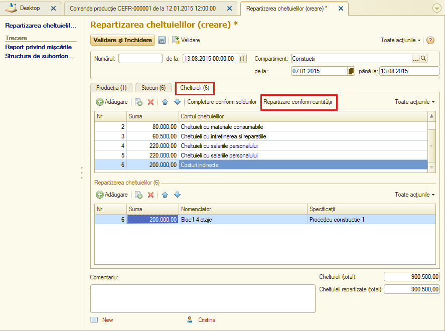
.. |image326| image:: media/image327.png
   :width: 5.608in
   :height: 2.43876in
