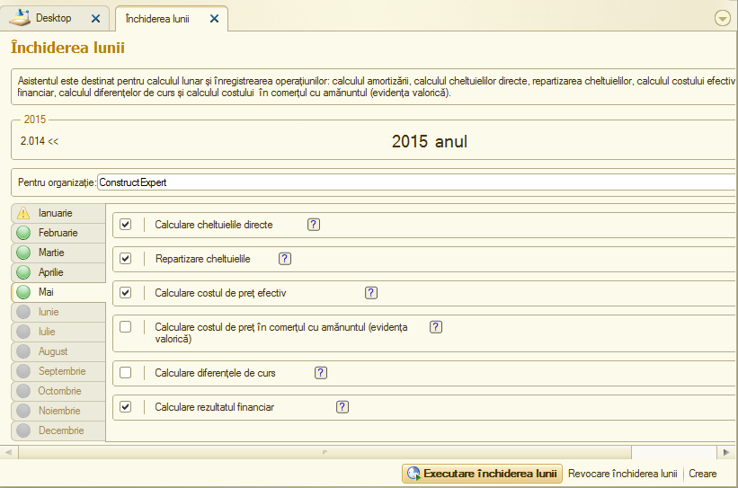
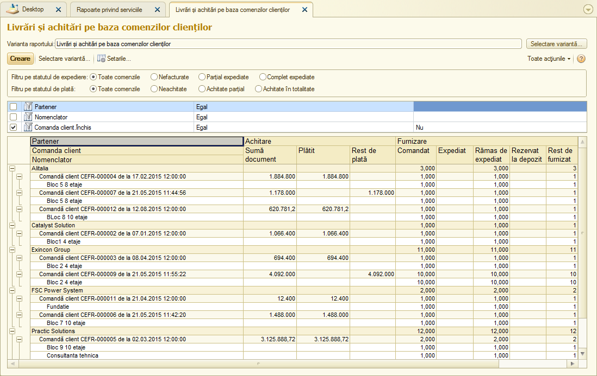
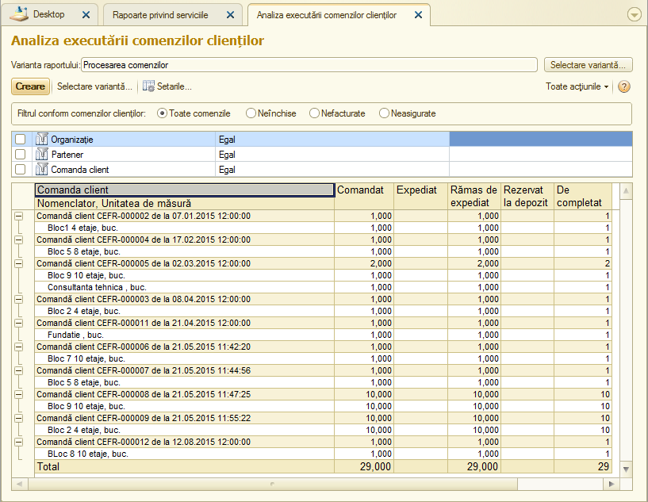
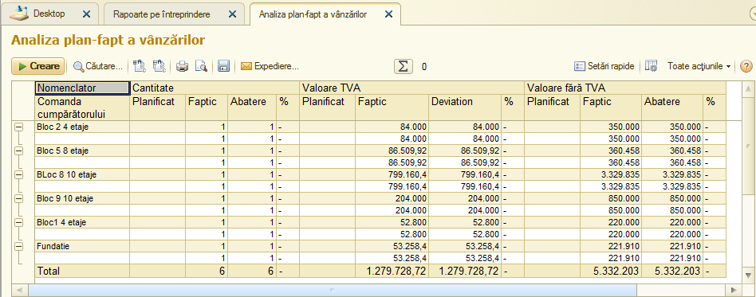
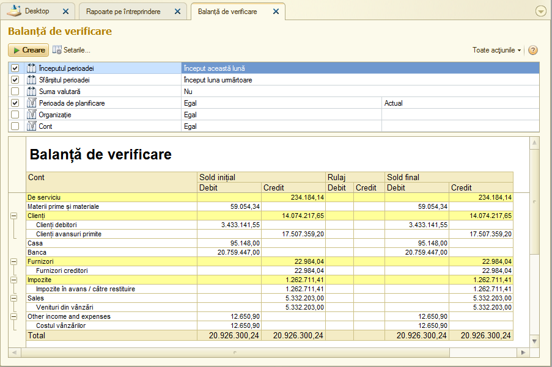
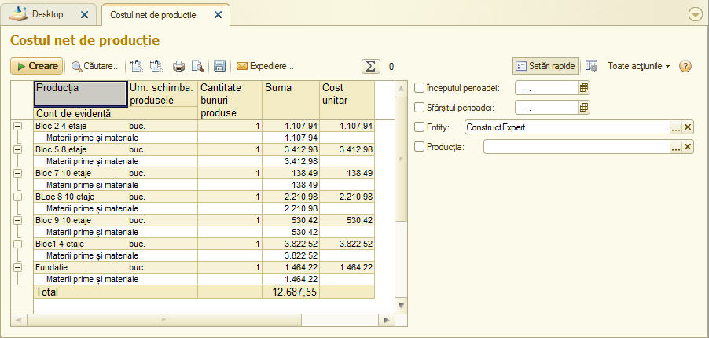
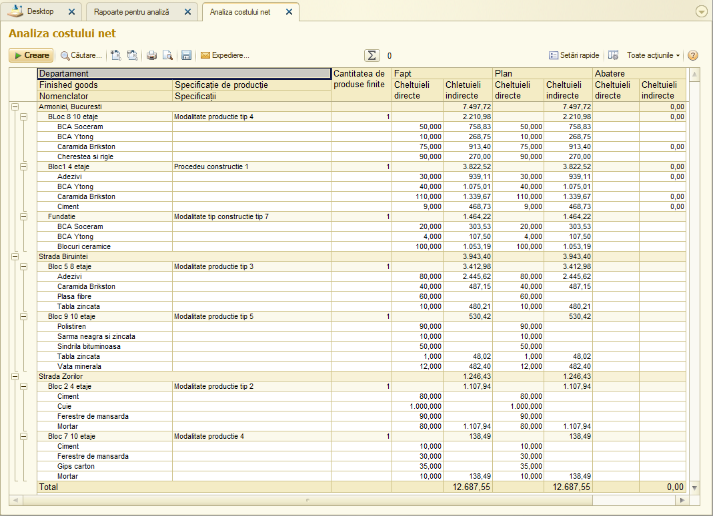

Sc.3.3. Închiderea lunii
-------------------------

Actul pentru închiderea lunii se află în modulul "Întreprindere". Stipulăm actul pe perioada de raportare şi-l bifăm.

|image328|

Raportul "Livrări și achitări pe baza comenzilor clienților"

|image329|

Raportul "Analiza executării comenzilor clienților"

|image330|

Raportul "Analiza plan-fapt a vânzărilor"

|image331|

Raportul "Balanța de verificare"

|image332|

Raportul "Costul net de producție"

|image333|

Raportul "Analiza costului net"

|image334|

